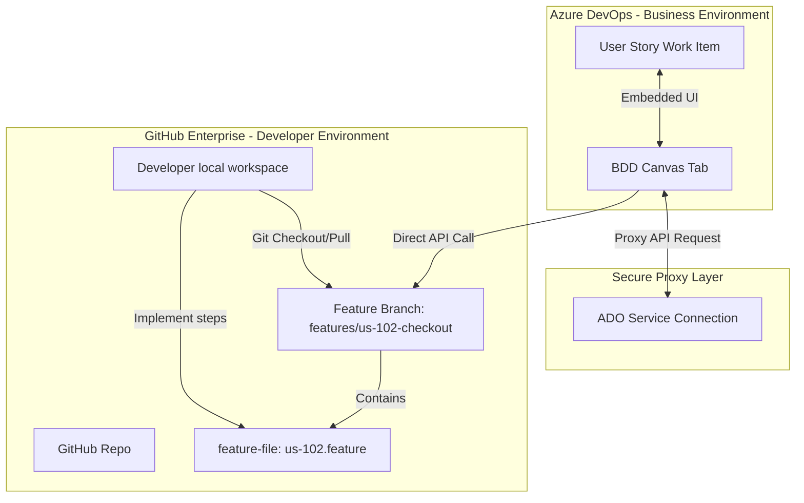
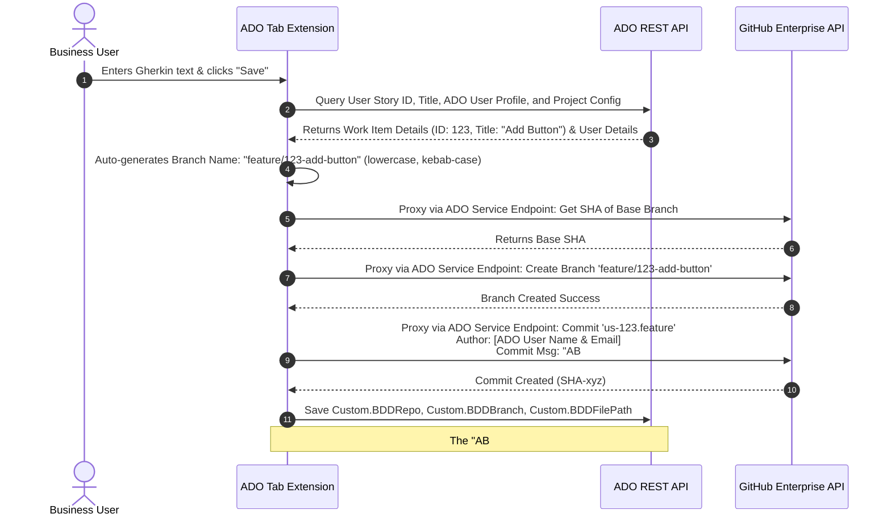
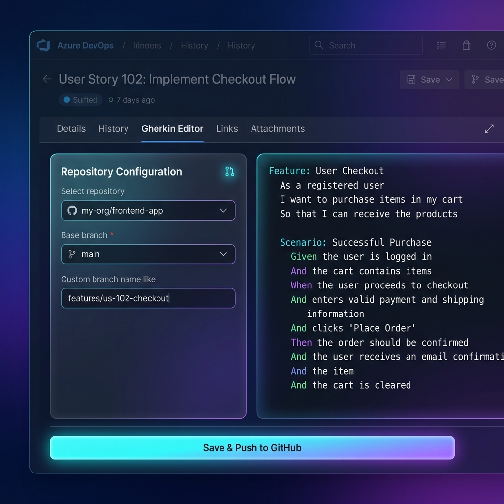

# Solution Architecture: Azure DevOps & GitHub Enterprise BDD Scenario Integration

This document outlines the solution architecture and feasibility analysis to enable non-technical business team members to capture BDD scenarios in Gherkin format directly within Azure DevOps (ADO) Boards and push them to a GitHub Enterprise repository under a custom feature branch linked to the respective ADO User Story.

---

## 1. Architectural Overview & Workflow Separation

To support the separation of concerns between business stakeholders and developers, the proposed solution ensures:
* **Business Team Source of Truth**: The business team uses the **Azure Boards User Story** as their workspace to write, review, and modify BDD scenarios. They do not need GitHub accounts, terminal access, or Git knowledge.
* **Developer Source of Truth**: Developers work **exclusively in GitHub** and their local IDEs. When they begin a User Story, they pull the automatically created feature branch which already contains the `.feature` file written by the business team.
* **Direct Integration via Proxy**: Any creation or modification done by the business team inside Azure Boards is asynchronously synced/committed to the GitHub Enterprise branch. The web extension securely proxies this REST API call through the Azure DevOps backend using a configured GitHub Service Connection, ensuring credentials are never exposed to the client.

---

## 2. Key Components

### A. Frontend: Azure DevOps Work Item Tab Extension
* **Technology**: Single Page Application (HTML5 / TypeScript / React) utilizing the `azure-devops-extension-sdk` and `azure-devops-extension-api`.
* **Editor**: [Monaco Editor](https://microsoft.github.io/monaco-editor/) configured with Gherkin language support for syntax highlighting (e.g., `Feature:`, `Scenario:`, `Given`, `When`, `Then`).
* **Placement**: Integrated as a dedicated custom tab (e.g., **"BDD Canvas"**) next to the standard "Details" and "History" tabs inside the User Story.

### B. Secure Configuration & Service Connection Proxy
To provide seamless access to all board members without requiring them to have personal GitHub accounts or exposing a shared Personal Access Token (PAT) to the browser:
1. An Azure DevOps Project Administrator configures a **GitHub Service Connection** for the project, embedding a Service Account PAT.
2. The target GitHub repository and base branch (e.g., `main`) are saved at the **Project Level** using `IExtensionDataService` (1-to-1 Repo to Board mapping).
3. The extension uses the ADO SDK (`TaskAgentRestClient.executeServiceEndpointRequest()`) to proxy REST API calls to GitHub through the ADO backend. The PAT never reaches the client browser.
4. When committing, the extension dynamically fetches the logged-in ADO user's profile (`VSS.getWebContext().user`) and sets the `author` and `committer` fields in the GitHub API payload, ensuring the git history accurately attributes the changes to the individual business user.

### C. State Tracking (ADO Custom Fields)
To maintain context, the ADO process template is customized to include three hidden/read-only metadata fields:
1. `Custom.BDDRepo`: The target GitHub repository name (e.g., `my-org/web-app`).
2. `Custom.BDDBranch`: The name of the feature branch created for this BDD file.
3. `Custom.BDDFilePath`: The path within the repo where the `.feature` file is saved (e.g., `tests/features/us-102.feature`).

---

## 3. Detailed Integration Flows

### Flow A: Creating a New BDD Branch & File (First-time Save)

When a business user writes a scenario and clicks **"Save & Push to GitHub"**:

### Flow B: Updating an Existing Feature File (Collaboration Cycle)

If a business team member updates the BDD scenario inside ADO after the developer has started working:
1. The business user opens the BDD Canvas tab on the ADO User Story, edits the Gherkin text, and clicks **"Save & Push to GitHub"**.
2. The ADO extension fetches the file's current SHA from GitHub API (proxied).
3. The extension commits the updated `.feature` file directly to the existing feature branch (`feature/123-add-button`) setting the `author` field to the ADO user.
4. The developer, working in GitHub, is notified of a new commit on their branch (or pulls changes via `git pull`). The local `.feature` file updates in their IDE.
5. Developers run tests locally, write step definitions, and merge the code through a Pull Request.

---

## 4. Feasibility Analysis: Displaying Content Inside ADO

> [!IMPORTANT]
> **Conclusion: Highly Feasible.**
> Fetching and displaying the Gherkin feature file contents directly inside the User Story is completely feasible and recommended.

### How it is achieved:
1. **GitHub API Integration**: Using the GitHub API `GET /api/v3/repos/{owner}/{repo}/contents/{path}?ref={branch}`, we can retrieve the base64-encoded content of the feature file dynamically.
2. **Visual Presentation**: Inside the custom ADO tab, we render a read-only instance of Monaco Editor or a styled preview panel. This ensures syntax highlighting is retained and the business user gets a native, clean viewing experience without having to jump to GitHub.
3. **Draft vs. Committed States**:
   - If no branch is created yet, we show an empty editor state with an initialization guide.
   - If a branch exists, we dynamically pull the latest code. If there are changes made by developers in that branch on GitHub, they will be visible to the business user inside ADO immediately.

### Feasibility Matrix

| Requirement | Feasibility | Technical Mechanism |
| :--- | :---: | :--- |
| **Gherkin Syntax Highlight** | **Yes** | Monaco Editor configured with `gherkin` language support. |
| **Select Repo & Base Branch** | **Yes** | GitHub Repo/Branch GET API called securely via PAT. |
| **Automated ADO Linkage** | **Yes** | Achieved natively via Azure Boards app for GitHub (by prefixing commit message with `AB#{id}`) or programmatically using ADO Links API. |
| **Subsequent Updates** | **Yes** | Stored references (`Custom.BDDBranch` / `Custom.BDDFilePath`) tell the extension to append commits to the same branch. |
| **Bi-directional Reading** | **Yes** | Extension fetches latest file content on-demand directly from GitHub via REST API. |

---

## 5. UI/UX Concept Design

Below is a high-fidelity visual design mockup of how this integrated "BDD Canvas" tab appears inside the Azure DevOps User Story form:

### Key UI Features:
* **Glassmorphism Theme**: Deep indigo and violet theme designed to fit into modern dark mode workflows.
* **Auto-Calculated Configuration**:
  * The user does not need to enter a token or select a repo. 
  * The branch name is automatically generated and displayed as `feature/<id>-<title>` in a read-only badge.
* **Code Editor (Right Panel)**: Monaco-based BDD Canvas editor.
* **Single Action Button**: Prominent "Save & Push to GitHub" button at the footer that orchestrates the entire workflow in one click.

---

## 6. Alternative Solutions Considered

### Alternative 1: Backend Sync Proxy (Custom Microservice/Function)
* **Pros**: Complete control over security and API request throttling.
* **Cons**: Adds infrastructure complexity, requires deploying external servers, introduces maintenance overhead, and breaks the "serverless" extension pattern.
* **Verdict**: Dismissed. The native Azure DevOps Service Connection approach securely proxies requests directly through ADO without requiring any custom middleware to be maintained.

### Alternative 2: External Portal (Standalone React App)
* **Pros**: No need to package and deploy an Azure DevOps Extension.
* **Cons**: Poorer user experience. Business users have to navigate away from Azure Boards, copy-paste work item IDs, and switch tabs constantly.
* **Verdict**: Not recommended. The native ADO Extension tab offers a seamless, in-context experience.

---

## 7. Implementation Plan

If approved, the implementation of this solution will progress through the following phases:

1. **Frontend Development (Extension)**:
   - Build ADO Extension layout and configure Monaco Editor.
   - Implement `IExtensionDataService` storage for GitHub config.
   - Implement direct GitHub API `fetch` wrappers (Create Branch, Put/Update File, Get File Content).
   - Package the extension using `tfx-cli` and publish to the Azure DevOps Marketplace (as private/shared).
2. **ADO Customization**:
   - Add custom fields (`Custom.BDDRepo`, etc.) to the User Story work item layout.
   - Add the extension tab to the User Story form template.
3. **Testing & Rollout**:
   - Instruct business users on generating their GitHub Enterprise PAT and adding it to the settings.
   - Verify linking behaves correctly (commits show up under the Development panel on the User Story).

---

## 8. Resiliency, Edge Cases, and Concurrency Management

This section details how the integration system mitigates real-world edge cases.

### 1. Branch Already Exists
* **Scenario**: A user clicks "Save & Push", but a branch named `features/us-102-checkout` already exists on GitHub (perhaps created by another system or developer).
* **Mitigation**:
  * Before branch creation, the extension calls the GitHub API to attempt branch creation. If it fails with `Reference already exists`, the extension safely ignores the error and proceeds to update the file in that existing branch.

### 2. Accidental Deletion of the Branch or File
* **Scenario**: A developer or automation script deletes the feature branch or the `.feature` file in GitHub by mistake before the work is completed.
* **Mitigation**:
  - The next time the ADO User Story BDD tab is loaded, the extension attempts to fetch the file and receives a `404 Not Found` from GitHub.
  - The extension falls back to check if it was merged to the base branch and displays the file content in Read-Only mode.

### 3. Extension Uninstalled by Mistake
* **Scenario**: An administrator uninstalls the Azure DevOps extension, causing users to lose the Gherkin tab.
* **Mitigation**:
  - **Data Retention**: Custom fields (`Custom.BDDRepo`, `Custom.BDDBranch`, `Custom.BDDFilePath`) are stored in the ADO Process Template database, not within the extension. User configurations are stored in the Extension Data Service.
  - **Seamless Recovery**: Once the extension is re-installed, the tab reads these populated custom fields and seamlessly resumes the session.

### 4. Branch Deleted After PR Merge
* **Scenario**: The feature branch is merged into `main` and deleted as part of standard git cleanup. The business user opens the ADO User Story afterward.
* **Mitigation**:
  - When the branch is deleted, the extension's call to GitHub `GET` on that branch returns `404`.
  - Instead of failing, the extension falls back to check the base branch (e.g. `main` or `develop`).
  - If the file is found in the base branch at the same path (`Custom.BDDFilePath`), it displays the file content in **Read-Only** mode, showing a status indicator: `Merged (Read-only)`.
