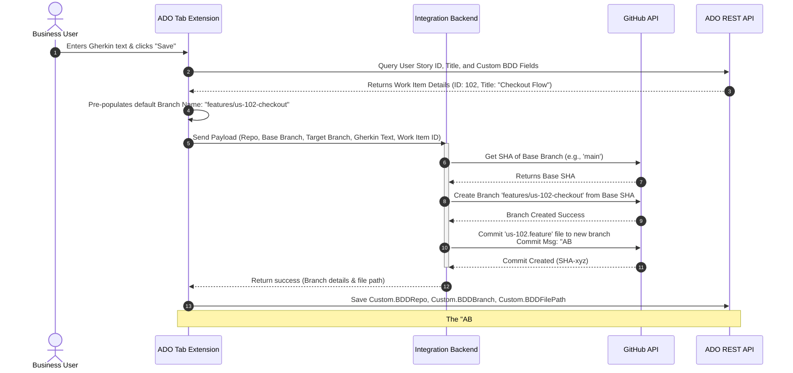

# Solution Architecture: Azure DevOps & GitHub BDD Scenario Integration

This document outlines the solution architecture and feasibility analysis to enable non-technical business team members to capture BDD scenarios in Gherkin format directly within Azure DevOps (ADO) Boards and push them to a GitHub repository under a custom feature branch linked to the respective ADO User Story.

---

## 1. Architectural Overview & Workflow Separation

To support the separation of concerns between business stakeholders and developers, the proposed solution ensures:
* **Business Team Source of Truth**: The business team uses the **Azure Boards User Story** as their workspace to write, review, and modify BDD scenarios. They do not need GitHub accounts, terminal access, or Git knowledge.
* **Developer Source of Truth**: Developers work **exclusively in GitHub** and their local IDEs. When they begin a User Story, they pull the automatically created feature branch which already contains the `.feature` file written by the business team.
* **Asynchronous Integration**: Any creation or modification done by the business team inside Azure Boards is asynchronously synced/committed to the GitHub branch in the background.

```mermaid
graph TD
    subgraph Azure DevOps - Business Environment
        US[User Story Work Item]
        Ext[BDD Canvas Tab]
        US <-->|Embedded UI| Ext
    end

    subgraph Sync Layer (Background)
        AF[Sync Service: Azure Function]
        Ext -->|1. Save Event| AF
    end

    subgraph GitHub - Developer Environment
        GH[GitHub Repo]
        Branch[Feature Branch: features/us-102-checkout]
        Feature[feature-file: us-102.feature]
        Dev[Developer local workspace]
        
        AF -->|2. Async Commit/Push| Branch
        Branch -->|Contains| Feature
        Dev -->|3. Git Checkout/Pull| Branch
        Dev -->|4. Implement steps| Feature
    end
```

---

## 2. Key Components

### A. Frontend: Azure DevOps Work Item Tab Extension
* **Technology**: Single Page Application (HTML5 / TypeScript / React) utilizing the `azure-devops-extension-sdk` and `azure-devops-extension-api`.
* **Editor**: [Monaco Editor](https://microsoft.github.io/monaco-editor/) configured with Gherkin language support for syntax highlighting (e.g., `Feature:`, `Scenario:`, `Given`, `When`, `Then`).
* **Placement**: Integrated as a dedicated custom tab (e.g., **"BDD Canvas"**) next to the standard "Details" and "History" tabs inside the User Story.

### B. Background Sync Service: Azure Function
* **Technology**: Node.js/TypeScript Azure Function or similar serverless container.
* **Purpose**: Azure DevOps extensions run in the user's browser inside an iframe. Making direct calls from the browser to GitHub with a shared secret or PAT is a critical security vulnerability. The Azure Function acts as a proxy:
  1. Authenticates the incoming request using the ADO User's JWT (provided by the ADO SDK via `SDK.getAppToken()`).
  2. Resolves GitHub credentials (e.g., GitHub App Installation Token or Organization-level PAT) securely from **Azure Key Vault**.
  3. Executes git operations (branch creation, commits, content fetching) on the GitHub API on behalf of the user.

### C. State Tracking (ADO Custom Fields)
To maintain context, the ADO process template is customized to include three hidden/read-only metadata fields:
1. `Custom.BDDRepo`: The target GitHub repository name (e.g., `my-org/web-app`).
2. `Custom.BDDBranch`: The name of the feature branch created for this BDD file.
3. `Custom.BDDFilePath`: The path within the repo where the `.feature` file is saved (e.g., `tests/features/us-102.feature`).

---

## 3. Detailed Integration Flows

### Flow A: Creating a New BDD Branch & File (First-time Save)

When a business user writes a scenario and clicks **"Save & Push to GitHub"**:



### Flow B: Updating an Existing Feature File (Collaboration Cycle)

If a business team member updates the BDD scenario inside ADO after the developer has started working:
1. The business user opens the BDD Canvas tab on the ADO User Story, edits the Gherkin text, and clicks **"Save & Push to GitHub"**.
2. The ADO extension sends the payload to the Sync Azure Function.
3. The Azure Function commits the updated `.feature` file to the existing feature branch (`features/us-102-checkout`) using the commit message: `"AB#102: Update BDD scenario for checkout"`.
4. The developer, working in GitHub, is notified of a new commit on their branch (or pulls changes via `git pull`). The local `.feature` file updates in their IDE.
5. Developers run tests locally, write step definitions, and merge the code through a Pull Request.

---

## 4. Feasibility Analysis: Displaying Content Inside ADO

> [!IMPORTANT]
> **Conclusion: Highly Feasible.**
> Fetching and displaying the Gherkin feature file contents directly inside the User Story is completely feasible and recommended.

### How it is achieved:
1. **GitHub API Integration**: Using the GitHub API `GET /repos/{owner}/{repo}/contents/{path}?ref={branch}`, we can retrieve the base64-encoded content of the feature file dynamically.
2. **Visual Presentation**: Inside the custom ADO tab, we render a read-only instance of Monaco Editor or a styled preview panel. This ensures syntax highlighting is retained and the business user gets a native, clean viewing experience without having to jump to GitHub.
3. **Draft vs. Committed States**:
   - If no branch is created yet, we show an empty editor state with an initialization guide.
   - If a branch exists, we dynamically pull the latest code. If there are changes made by developers in that branch on GitHub, they will be visible to the business user inside ADO immediately.

### Feasibility Matrix

| Requirement | Feasibility | Technical Mechanism |
| :--- | :---: | :--- |
| **Gherkin Syntax Highlight** | **Yes** | Monaco Editor configured with `gherkin` language support. |
| **Select Repo & Base Branch** | **Yes** | GitHub Repo/Branch GET API called through the Azure Function backend. |
| **Automated ADO Linkage** | **Yes** | Achieved natively via Azure Boards app for GitHub (by prefixing commit message with `AB#{id}`) or programmatically using ADO Links API. |
| **Subsequent Updates** | **Yes** | Stored references (`Custom.BDDBranch` / `Custom.BDDFilePath`) tell the extension to append commits to the same branch. |
| **Bi-directional Reading** | **Yes** | Extension fetches latest file content on-demand directly from GitHub via REST API. |

---

## 5. UI/UX Concept Design

Below is a high-fidelity visual design mockup of how this integrated "BDD Canvas" tab appears inside the Azure DevOps User Story form:


### Key UI Features:
* **Glassmorphism Theme**: Deep indigo and violet theme designed to fit into modern dark mode workflows.
* **Repository Configuration (Left Panel)**: 
  * Simple, clear dropdown menus for Repository and Base branch.
  * Auto-calculated branch name (editable if needed, but defaults to standard conventions to keep things simple for non-tech users).
* **Code Editor (Right Panel)**: Monaco-based BDD Canvas editor.
* **Single Action Button**: Prominent "Save & Push to GitHub" button at the footer that orchestrates the entire workflow in one click.

---

## 6. Alternative Solutions Considered

### Alternative 1: Using Azure DevOps Git Repositories (ADO Repos) instead of GitHub
* **Pros**: Native integration, simpler authentication, permissions are managed directly in ADO.
* **Cons**: Many organizations have standardized on GitHub for source code hosting. Forcing developers to check code in ADO Repos just for BDD tests creates a disjointed developer workflow.
* **Verdict**: Not recommended if the development code sits on GitHub. The proposed solution keeps developers on GitHub while keeping business users on Azure Boards.

### Alternative 2: External Portal (Standalone React App)
* **Pros**: No need to package and deploy an Azure DevOps Extension.
* **Cons**: Poorer user experience. Business users have to navigate away from Azure Boards, copy-paste work item IDs, and switch tabs constantly.
* **Verdict**: Not recommended. The native ADO Extension tab offers a seamless, in-context experience.

---

## 7. Implementation Plan

If approved, the implementation of this solution will progress through the following phases:

1. **Prerequisites & Infrastructure**:
   - Provision Azure Key Vault.
   - Deploy Azure Function skeleton.
   - Configure a GitHub App with `contents:write` and `metadata:read` permissions, and install it on the target GitHub organization.
2. **Backend Development**:
   - Implement authorization validation in Azure Function (validating ADO JWT tokens).
   - Implement GitHub API wrappers (Create Branch, Put/Update File, Get File Content).
3. **Frontend Development (Extension)**:
   - Build ADO Extension layout and configure Monaco Editor.
   - Implement API calls to the Azure Function.
   - Package the extension using `tfx-cli` and publish to the Azure DevOps Marketplace (as private/shared).
4. **ADO Customization**:
   - Add custom fields (`Custom.BDDRepo`, etc.) to the User Story work item layout.
   - Add the extension tab to the User Story form template.
5. **Testing & Rollout**:
   - Verify linking behaves correctly (commits show up under the Development panel on the User Story).
   - Train business users.

---

## 8. Resiliency, Edge Cases, and Concurrency Management

This section details how the integration system mitigates real-world edge cases.

### 1. Branch Already Exists
* **Scenario**: A user clicks "Save & Push", but a branch named `features/us-102-checkout` already exists on GitHub (perhaps created by another system or developer).
* **Mitigation**:
  * Before branch creation, the Azure Function calls the GitHub API `GET /repos/{owner}/{repo}/branches/{branch}`.
  - If the branch exists:
    - **Case A (Expected flow)**: If `Custom.BDDBranch` already matches this branch name, the backend simply pushes a new commit to it.
    - **Case B (Conflict)**: If `Custom.BDDBranch` is empty but the branch exists on GitHub, the extension UI prompts the user: *"A branch named features/us-102-checkout already exists on GitHub. Do you want to connect to it, or append a unique suffix (e.g., features/us-102-checkout-v2)?"*

### 2. Accidental Deletion of the Branch or File
* **Scenario**: A developer or automation script deletes the feature branch or the `.feature` file in GitHub by mistake before the work is completed.
* **Mitigation**:
  - The next time the ADO User Story BDD tab is loaded, the extension attempts to fetch the file and receives a `404 Not Found` from GitHub.
  - The extension UI detects this and displays a warning banner: *"Warning: The linked branch/file was not found on GitHub. The local ADO draft is preserved."*
  - The user is presented with a **"Re-sync to GitHub"** button, which recreates the branch from the base branch and pushes the current text as a fresh commit.

### 3. Concurrent Editing by Multiple Business Users
* **Scenario**: User A and User B open the same User Story's BDD Canvas tab at the same time. Both make changes.
* **Mitigation**:
  - **Optimistic Locking via Revision Checking**:
    - When the BDD extension loads, it records the initial Work Item `System.Rev` (Revision number) and the remote GitHub file's `SHA`.
    - When a user clicks "Save", the extension fetches the latest revision of the work item and the latest GitHub file SHA.
    - If either has changed, the save is aborted.
    - The UI displays an alert: *"Conflict Detected: Another user has updated this work item or feature file. Please copy your unsaved text, refresh the page, and merge your changes manually."*

### 4. Simultaneous Commits (Race Condition)
* **Scenario**: Both User A and User B click "Save" at the exact same millisecond.
* **Mitigation**:
  - The GitHub API handles commit concurrency using Git's content hashing. When pushing a commit, the backend must supply the `sha` of the parent commit.
  - The user whose request reaches the GitHub API second will fail with a `409 Conflict` (or non-fast-forward error) because the remote ref SHA no longer matches their parent SHA.
  - The backend catches this `409` error and returns a clean message to the frontend: *"Save failed due to concurrent repository update. Please refresh the scenarios and try again."*

### 5. Extension Uninstalled by Mistake
* **Scenario**: An administrator uninstalls the Azure DevOps extension, causing users to lose the Gherkin tab.
* **Mitigation**:
  - **Data Retention**: Custom fields (`Custom.BDDRepo`, `Custom.BDDBranch`, `Custom.BDDFilePath`) are stored in the ADO Process Template database, not within the extension. Uninstalling the extension does not delete the fields' values.
  - **Seamless Recovery**: Once the extension is re-installed, the tab reads these populated custom fields and instantly reconnects to the GitHub repository and branch.
  - **Link Fallback**: If the custom fields are somehow cleared, the extension queries the work item's links using the ADO REST API, filtering for relations of type `GitHub Branch` or `GitHub Commit` to find and restore the connection automatically.

### 6. Branch Deleted After PR Merge
* **Scenario**: The feature branch is merged into `main` and deleted as part of standard git cleanup. The business user opens the ADO User Story afterward.
* **Mitigation**:
  - When the branch is deleted, the extension's call to GitHub `GET` on that branch returns `404`.
  - Instead of failing, the extension falls back to check the Pull Request status or the base branch (e.g. `main` or `develop`).
  - If the file is found in the base branch at the same path (`Custom.BDDFilePath`), it displays the file content in **Read-Only** mode, showing a status indicator: `Merged to main`.
  - If the business user needs to make further updates:
    - The UI enables a **"Create New Revision Branch"** button.
    - Clicking this creates a new feature branch (e.g. `features/us-102-checkout-v2`) from `main`, pushes the new edits, and updates `Custom.BDDBranch` accordingly, resuming the lifecycle.

---

## 9. Advanced Solution Considerations (Security, Quality, and Governance)

As a Solution Architect, the following production-grade topics should be addressed during implementation:

### 1. Granular RBAC and Write Protection
* **Problem**: Pushing directly to GitHub branches requires push access. However, giving full write access to all business users creates a compliance/security risk.
* **Solution**: Business users never directly access GitHub. They authenticate against Azure DevOps. The Azure Function proxy checks the user's ADO Security Group (e.g., `BDD-Authors`). Only authorized ADO users can invoke the sync service. The Azure Function then uses a central GitHub App token with write permissions scoped strictly to `contents:write` on the target repos.

### 2. Gherkin Syntax Linting at the Source
* **Problem**: If a business user saves a feature file with syntax errors (e.g., spelling `Sceario` instead of `Scenario`), it will break the developers' local builds and CI/CD automated test pipelines.
* **Solution**: Embed a clientside Gherkin parser/linter (like `gherkin-lint` rules compiled to WebAssembly) directly in the Monaco Editor. If there are syntax errors, the editor highlights them in red and disables the "Save & Push" button.

### 3. Developer Feedback Loop (PR Status in ADO)
* **Problem**: Once the developer receives the branch, they might raise questions or request changes on the Pull Request. How does the business user find out?
* **Solution**: The BDD Canvas extension can query the GitHub PR status API. If an open PR is linked to the branch, the ADO UI can display a PR status indicator (e.g. `Draft`, `Under Review - Changes Requested`, `Passed CI Tests`) and list direct links to reviews, helping close the feedback loop inside ADO.

### 4. Git Rate Limit Safeguards
* **Problem**: Large organizations with hundreds of active product managers might hit GitHub's API rate limits during peak hours.
* **Solution**: 
  - Standard user token limits are 5,000 requests/hr.
  - The solution must use a **GitHub App** installation token, which raises the rate limit dynamically to **12,500+ requests/hour** based on organization size and repository count.
  - The Azure Function can implement an in-memory Redis cache for read-only metadata (like repository lists, branch lists) with a short TTL (e.g. 5 minutes) to minimize redundant API calls.

### 5. Multilingual BDD Support
* **Problem**: International business teams may write scenarios in languages other than English (e.g., German `# language: de` or Spanish `# language: es`).
* **Solution**: Ensure the linter configuration inside the Monaco Editor respects Gherkin's localization header tag `# language: xx` so that localized keywords (e.g. `Caso`, `Dado`, `Cuando`, `Entonces`) do not trigger syntax errors.
