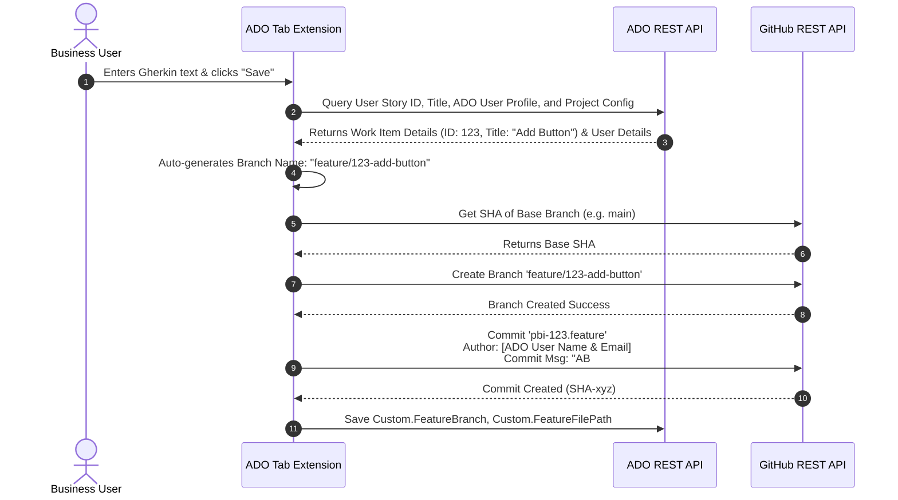

# Solution Architecture: Azure DevOps & GitHub Enterprise BDD Integration

This document outlines the solution architecture enabling business team members to capture BDD scenarios in Gherkin format directly within Azure DevOps (ADO) Boards, automatically syncing them to a GitHub repository feature branch linked to the ADO User Story.

---

## 1. Architectural Overview & Workflow Separation

To support the separation of concerns between business stakeholders and developers, the proposed solution ensures:
* **Business Team Source of Truth**: The business team uses the **Azure Boards User Story** as their workspace to write, review, and modify BDD scenarios. They do not need GitHub accounts, terminal access, or Git knowledge.
* **Developer Source of Truth**: Developers work **exclusively in GitHub** and their local IDEs. When they begin a User Story, they pull the automatically created feature branch which already contains the `.feature` file.
* **Direct Integration via ADO Extension Data**: The extension securely retrieves a centralized GitHub Personal Access Token configured at the project level and performs direct REST API calls from the browser to GitHub to commit the `.feature` file.

```mermaid
graph TD
    subgraph Azure DevOps - Business Environment
        US[User Story Work Item]
        Ext[BDD Canvas Tab]
        US <-->|Embedded UI| Ext
    end

    subgraph Secure Configuration Layer
        Data[ADO Extension Data Service]
        Ext <-->|Fetch Project Settings| Data
    end

    subgraph GitHub - Developer Environment
        GH[GitHub Repo]
        Branch[Feature Branch: feature/123-add-button]
        Feature[feature-file: pbi-123.feature]
        Dev[Developer local workspace]
        
        Ext -->|Direct fetch() API Call| Branch
        Branch -->|Contains| Feature
        Dev -->|Git Checkout/Pull| Branch
        Dev -->|Implement steps| Feature
    end
```

---

## 2. Key Components

### A. Frontend: Azure DevOps Work Item Tab Extension
* **Technology**: HTML5 / TypeScript utilizing the `azure-devops-extension-sdk` and `azure-devops-extension-api`.
* **Editor**: [Monaco Editor](https://microsoft.github.io/monaco-editor/) configured with Gherkin language support for syntax highlighting.
* **Placement**: Integrated as a dedicated custom tab (e.g., **"BDD Canvas"**) next to the standard "Details" and "History" tabs inside the User Story.

### B. Configuration & GitHub Integration
To provide seamless access to all board members without requiring them to have personal GitHub accounts:
1. An Azure DevOps Project Administrator configures a **GitHub Personal Access Token (PAT)** for the project via a custom Admin Hub ("BDD GitHub Settings").
2. The target GitHub repository, base branch, and the PAT are saved at the **Project Level** using `IExtensionDataService`.
3. The extension retrieves the PAT and directly communicates with the GitHub REST API using `fetch`.
4. When committing, the extension dynamically fetches the logged-in ADO user's profile (`VSS.getWebContext().user`) and sets the `author` and `committer` fields in the GitHub API payload, ensuring the git history accurately attributes the changes to the individual business user.

### C. State Tracking (ADO Custom Fields)
To maintain context, the ADO process template is customized to include two hidden/read-only metadata fields on the User Story layout:
1. `Custom.FeatureBranch`: The name of the feature branch created for this BDD file (e.g., `feature/123-add-button`).
2. `Custom.FeatureFilePath`: The path within the repo where the `.feature` file is saved (e.g., `tests/features/pbi-123.feature`).

---

## 3. Detailed Integration Flows

### Flow A: Creating a New BDD Branch & File (First-time Save)

When a business user writes a scenario and clicks **"Save & Push to GitHub"**:



### Flow B: Updating an Existing Feature File (Collaboration Cycle)

If a business team member updates the BDD scenario inside ADO after the developer has started working:
1. The business user opens the BDD Canvas tab, edits the Gherkin text, and clicks **"Save & Push to GitHub"**.
2. The ADO extension fetches the file's current SHA from GitHub API.
3. The extension commits the updated `.feature` file directly to the existing feature branch (`feature/123-add-button`), overwriting the old file.
4. Developers run tests locally, write step definitions, and merge the code through a Pull Request.

---

## 4. UI/UX Concept Design

Below is a high-fidelity visual design mockup of how this integrated "BDD Canvas" tab appears inside the Azure DevOps User Story form:


### Key UI Features:
* **Glassmorphism Theme**: Deep indigo and violet theme designed to fit into modern dark mode workflows.
* **Auto-Calculated Configuration**: The branch name is automatically generated and displayed as `feature/<id>-<title>` in a read-only badge.
* **Code Editor (Right Panel)**: Monaco-based BDD Canvas editor.
* **Single Action Button**: Prominent "Save & Push to GitHub" button at the footer that orchestrates the entire workflow in one click.

---

## 5. Resiliency, Edge Cases, and Concurrency Management

### 1. Branch Already Exists
* **Mitigation**: Before branch creation, the extension attempts branch creation. If it fails with `Reference already exists`, the extension safely ignores the error and proceeds to update the file in that existing branch.

### 2. Accidental Deletion of the Branch or File
* **Mitigation**: If the file is deleted on GitHub, the extension will receive a `404 Not Found` when trying to load it. It then checks the base branch. If it was merged to the base branch, it loads the content in Read-Only mode.

### 3. Extension Uninstalled by Mistake
* **Mitigation**: The branch linkage is stored in ADO Work Item custom fields (`Custom.FeatureBranch`, `Custom.FeatureFilePath`), not the extension itself. Re-installing the extension seamlessly restores functionality.
